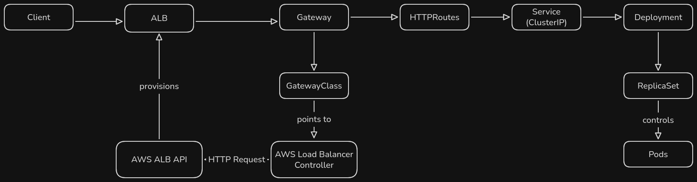

## Gateway API Deployment

**Summary** Small lab that demonstrates how to deploy a service behind Gateway
API on EKS.

All the resources are created under the "gwad" namespace so deletion is easier.

```bash
kubectl delete namespace gwad
```

### Prerequesites

#### Gateway API CRD's

```bash
kubectl apply --server-side=true -f https://github.com/kubernetes-sigs/gateway-api/releases/download/v1.5.0/standard-install.yaml
```

#### Install the AWS's Load Balancer Controller (AWS LBC)

Create the necessary IAM policy.

```bash
curl -O https://raw.githubusercontent.com/kubernetes-sigs/aws-load-balancer-controller/main/docs/install/iam_policy.json

aws iam create-policy \
  --policy-name AWSLoadBalancerControllerIAMPolicy \
  --policy-document file://iam_policy.json
```

Create the necessary IAM role.

```bash
cat > trust-policy.json << 'EOF'
{
  "Version": "2012-10-17",
  "Statement": [
    {
      "Effect": "Allow",
      "Principal": { "Service": "pods.eks.amazonaws.com" },
      "Action": ["sts:AssumeRole", "sts:TagSession"]
    }
  ]
}
EOF

aws iam create-role \
  --role-name AmazonEKSLoadBalancerControllerRole \
  --assume-role-policy-document file://trust-policy.json

aws iam attach-role-policy \
  --role-name AmazonEKSLoadBalancerControllerRole \
  --policy-arn arn:aws:iam::843681855384:policy/AWSLoadBalancerControllerIAMPolicy
```

ServiceAccount creation for the controller's Pods.

```bash
kubectl create serviceaccount aws-load-balancer-controller -n kube-system
```

Pod Identity association.

```bash
aws eks create-pod-identity-association \
  --cluster-name andrekb \
  --namespace kube-system \
  --service-account aws-load-balancer-controller \
  --role-arn arn:aws:iam::843681855384:role/AmazonEKSLoadBalancerControllerRole
```

Finally install the controller.

```bash
helm repo add eks https://aws.github.io/eks-charts
helm repo update

helm install aws-load-balancer-controller eks/aws-load-balancer-controller \
  -n kube-system \
  --set clusterName=andrekb \
  --set serviceAccount.create=false \
  --set serviceAccount.name=aws-load-balancer-controller \
  --set vpcId=vpc-032ea1e982481bc78
  --set region=eu-central-1
```

Confirm version is >= 2.14.0 for Gateway API support.

```bash
helm search repo eks/aws-load-balancer-controller --versions | head
```

### Request Flow



