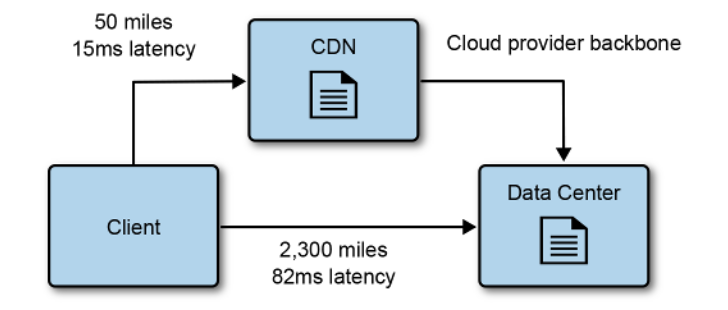

# Working with Data

NOTE: These topics are related to Data Engineering field.

Cloud native applications work very well with the polyglot model for data
storage. That is, multiple data store technologies are used together in an
application, taking advantage of their strengths. For example, a SQL database
for transactional data (MySQL); an object store to store files (S3); a Cache
store for ephemeral data (Redis); a NoSQL database for document storage or key
value stores (DynamoDB).

For cloud native environments in almost all use cases you should use a *managed
datastore service* (such as AWS RDS or AWS DynamoDB). This reduces costs and
operation overhead.

*In-memory*: Datastores that store data in memory instead of disk. Usually
employed for ephemeral data, and are insanely fast. Examples: Redis, Memached.

*Strong consistency*: After a write completes, every read on any node always
returns the latest value. Lower availability and speed.

*Eventual consistency*: After a write completes, a read on a node may return the
old value but only for a while. Higher availability and speed.

## Datastore Types

*Datastore*: Refers to services/technologies that store data at the application
level (usually user block storage as underlying mechanism).

### Object Store

Used for storing files such as static web assets, images, videos, etc. Highly
durable and available, very cheap. Stores files as objects: contain the file and
associated metadata. Examples: AWS S3, Google Cloud Storage, Azure Blob Storage,
MinIO (on-prem).

### Databases

*Database*: Used for storing structured data with well-defined formats. There
are many different types of databases with very different underlying mechanisms
and adequate for different use cases. The following table briefly describes
them.

| Database    | Description                                                                                                                                                                                                                                                                                                                                                |
| ----------- | ---------------------------------------------------------------------------------------------------------------------------------------------------------------------------------------------------------------------------------------------------------------------------------------------------------------------------------------------------------- |
| Key/value   | A very large hash table that stores some value under a unique key. Used for data that needs to be retreived only using said key or part of it. Some key value datastores allow for compound keys and ordering: for example searching for customerid-orderid, this is a compound key with the key prefix customerid. Examples: DynamoDB, Redis (in-memory). |
| Document    | Similar to key value datastore except it enforces a particular document format, most commonly JSON (although internal DB engines use more efficient document format based on JSON such as MongoDB's BSON). They can be used much like a relational database and map nicely into objects. Examples: MongoDB, CouchDB.                                       |
| Relational  | Enforces a strict schema that organizes data into tables. Very mature and the most widely adopted good for data that has a lot of relations and require transactions. Examples: MySQL, PostgreSQL, MariaDB, Oracle Database.                                                                                                                               |
| Graph       | Store two types of information: edges and nodes. Nodes can be though as of entities and edges as relationships between nodes. Both can contain information on one or the other. Examples: Neo4j, ArangoDB, Amazon Neptune.                                                                                                                                 |
| Time-series | Optimized for storing values based on time. Commonly used to collect large amount of small writes from various sources (for example IoT devices, or collecting logs and monitor devices). Updates to data are rare and deletes are often completed in bulk. Examples: InfluxDB, Prometheus, QuestDB.                                                       |
| Search      | Search engine databases are often used to search information held in other datastores. They index large amounts of data in those datastores providing almost real time access to the indexes. They can be used to search structured data (for example on top of another datbase), or unstructured data. Examples: Elastisearch, OpenSearch, Apache Solr.   |

### Streams and Queues

Streams and queues are datastores that store events and messages.

*Stream*: Streams store data made available over time. They are usually employed
for log streams or event streams.

*Queues*: Queues usually store messages that can be read or removed by
subscribers, they are named message queues. A *message queue* will have one
subscriber, a *topic* has multiple.

## Data in Multiple Datastores

In distributed systems having data across different datastores is the norm. Some
of the challenges:

- Data consistency across the datastores. This is the most notible challenge.
- Analysis of the data across the datastores.
- Backup of the data across the datastores.

### Change Data Capture (CDC)

*Change Data Capture (CDC)*: The process of identifying and capturing changes
made to a datastore (writes), so that other services/systems can react to.
Example: if a orders service inserts a record we may have another service
respond to that event by updating a user profile.

Some databases support CDC natively by exposing changes as event streams,
allowing external consumers to react to inserts, updates, or deletes in real
time. Examples: AWS DynamoDb, AWS RDS Aurora, MongoDB.

Databases that don't support CDC natively implement it with different mechanisms
that depend on the DBMS itself, and then have another system consume the changes
(AWS DMS is able to do that).MySQL supports CDC by using binary logs (must
enable log_bin and set binlog_format=ROW). PostgreSQL supports CDC by enabling
logical replication
(https://www.postgresql.org/docs/17/logical-replication-quick-setup.html).

The events for the datastore are usually stored in *change event streams*. If
the datastore doesn't support change event streams it

For AWS specifically: AWS Aurora MySQL and DynamoDB directly support database
activity streams. For other databases you may need to enable logging and use the
AWS DMS service to respond to changes.

### Extract, Transform, and Load

*ETL*: The practice of ETL (extract, transform, and load) is usually employed to
extract data from various sources: databases, enterprise systems such as ERPs
and CRMs, APIs, etc, into a single source of truth (data lakes or data
warehouses). It's thus taking data and transforming it into useful information.
Example tools include: Informatica PowerCenter, AWS Glue, IBM DataStage, SAP
Data Services, Apache NiFi. ETL is mostly employed for business intelligence
contexts.

*Business Intelligence*: The practice of collecting (using ETL) and analyzing
data to make better informed business decisions in different business
intelligence areas such as sales, operations, marketing, hr, etc.

*Data Lake*: A central repository that stores massive amounts of raw data in
original format. Can handle structured, unstructured, and different formats of
data. Typically used for big data analytics, ML, and exploratory analysis.
Examples: Amazon Athena, AWS Lake Formation, Hadoop Distributed File System
(HDFS), Databricks Lakehouse.

*Data Warehouse*: A central repository that stores massive amounts of organized
and structured data. That is, it stores information that went through analysis.
Usually the targets of BI data. Examples: Amazon Redshift, Snowflake,
GoogleBiQuery.

### Microservices and Data

In microservices there is often the need to perform analysis on data that comes
from multiple services (multiple datastores). To perform analytics the data
needs to be stored in a common datastore (usually a data lake or data
warehouse). Thus the best approach is to aggregate the data from multiple
services into a common datastore to be used by the analytics team. The
approaches to move the data to the common datastore were already discussed: CDC
or ETL (although others exist).

## Fast Scalable Data

*A vast majority of application scaling and performance problems can be
attributed to databases.*

Scaling data systems can be done through *partitioning* (sharding) and
*replication* (caching).

### Sharding 

*Sharding*: Dividing the datastore into horizontal partitions known as shards.
Each shards contains a subset of the data (same schema).

### Caching

*Caching*: Having data in a faster storage closer to the consumer. Caches store
in memory most of the time.

Keeping data from the source synchronized with the cache is challenging. A list
of common approaches to update or invalidate data in a cache:

- Rely on TTL configurations to remove an item from the cache. The application
  is then responsible for checking the cache for the item.
- Use CDC to update the cache.
- Application logic is responsible for updating or invalidating the cache.
- Use a passthrough caching layer. This removes responsibility from the
  application.

### Content Delivery Networks

*CDNs are great, they should be used often.*

*Content Delivery Network (CDN)*: A group of geographically distributed
datacenters known as points of presence (POP). They cache data and reduce load
from origin servers. Cached data usually has TTL configurations. Another
important concept is the *cache key*: what defines a unique cached object, cache
keys are mostly based on URLs (for example /user/geoff?size=big and
/user/geoff?size=small may be treated as the same object if the CDN only treats
the URL as a cache key and ignores query parameters).

CDNs are commonly used to cache static content (for example from a web app)
closer to the user thus reducing latency.

## Analyzing Data

Analyzing data is all about extracting useful information from it. Data stored
continues to grow at exponential rates, companies use different tools to extract
information from data.

*Stream*: Streams produce data continuously over time (some times indefinetly)
and are processed in the same fashion. Analyzing streams in real time is a great
way to get on demand business insights.

*Batch*: A collection of data that is processed all at once (spaced in large
intervals). Batch processing usually happens in very large bounded data sets
with the intent of exploring data science hypothesis.

*Data analytics systems tipically use a combination of stream and batch
processing.*

