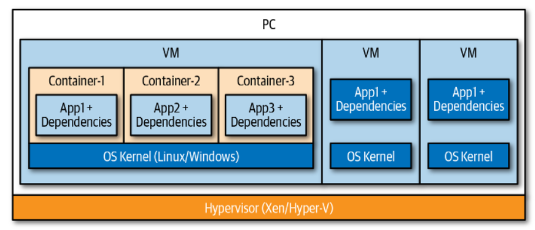
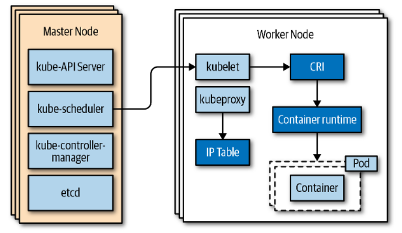

# Cloud Native

Cloud native applications are distributed systems.

*Distributed System*: Several computers connected over a network that appear as
a single unit/system. They generaly work towards the same goal or application.

Scaling in the cloud is done *horizontally* most of the times. A concept known
as *elasticity* (it's easy to scale horizontally in the cloud).

By default cloud native applications are stateless, and should be designed with
stateless in mind.

Most cloud native applications should be seperated in different environments:
development, staging, and production.

The cloud is a *pay as you go* service.

Microservices is the most common architecture in the cloud. The most common
compute workloads are containers and functions (functions come associated, most
of the time, with event-driven communication patterns).

Event driven architectures (they utilize asyncrhnous communication patterns) are
also very common in the cloud, the main compute workload for these are mainly
functions.

## Communication Patterns

There are mainly two ways a service or function can communicate in the cloud:
synchronously and asynchronously.

| Type         | Examples                                |
| ------------ | --------------------------------------- |
| Synchronous  | HTTP (REST APIs), gRPC, GraphQL         |
| Asynchronous | Message Queue, Event Streaming, Pub/Sub |

## Common Falacies Assumed in Cloud Native Systems

- *The network is reliable*: Because services communicate in a network you need
  to consider that the network (even in the cloud) may still fail. You also
  should look at security, latency, bandwidth, and traffic cost, aswell as
  serialization overhead (deserializing JSON for example). These are crucial
  aspects that should absolutely be considered when designing cloud native
  systems.

- *Topology does not change*: Cloud systems are optimized to be elastic meaning
  that you treat infrastructure with a set of discardable properties (for
  example in EC2 the IP of a machine changes when the state of the machine
  changes). This is known as the *immutable infrastrcuture* paradigm, a reason
  why containers are amazing in the cloud (they are immutable by default, i.e,
  they properties don't matter, they can easily be scaled up or down).

## CAP Theorem

It dictates that in the cloud you can either optimize a system to be
*consistent* or *available*.

## The Twelve-Factor App

It's an application methodology that is considered the foundation for building
cloud native applications.

1. *Codebase*: One codebase, many deploys (dev, stage, prod).

2. *Dependencies*: Explicitly declare and isolate dependencies (again containers
   are excelent here).

3. *Configuration*: Configuration (DB credentials for example) should be stored
   in the environment. Never store configuration in code, most tools in the
   cloud allow for environment setup.

4. *Backing Services*:

5. *Build, Release, Run*: Strictly seperate these stages and automate them using
   CI/CD pipelines.

6. *Processes*: Execute services in one or more stateless processes, data should
   be saved in DBs or caches. Again, this goes hand in hand with elasticity in
   the cloud.

7. *Data Isolation*: Each service manages it's own data, no other service can
   access it. This is a key tenet of microservices architecture.

8. *Concurrency*: Scale out via the process model.

9. *Disposability*: Maximize robustness with fast startup and graceful shutdown.
   Containers and functions already provide this by default. Also keep in mind
   scaling up or down according to load.

10. *Dev/Prod Parity*: Keep development, staging, and production environments as
    similar as possible.

11. *Logs*: Treat logs as event streams, meaning that you route them to an
    external system for analysis (for example having an AWS account just for
    logging).

12. *Admin Processes*: Run admin and management tasks as one-off processes.

## Availability and SLAs

Common uptime percentages and service downtime

| Availability | Downtime per Year | Downtime per Month | Downtime per Week |
| ------------ | ----------------- | ------------------ | ----------------- |
| 99%          | 3.65 days         | 7.20 hours         | 1.68 hours        |
| 99.9%        | 8.76 hours        | 43.2 minutes       | 10.1 minutes      |
| 99.99%       | 52.56 minutes     | 4.32 minutes       | 1.01 minutes      |
| 99.999%      | 5.26 minutes      | 25.9 seconds       | 6.05 seconds      |
| 99.9999%     | 31.5 seconds      | 2.59 seconds       | 0.605 seconds     |

In general, high availability is harder to design and it's more costly.

## Containers

Bellow is an image that represents the difference between traditional VMs and
containers.

Containers are very lightweight. They use a filesystem mechanism called
*copy-on-write*, which allows containers to share the same data, when a
container needs to modify the data the underlying OS provides a copy to it.

VMs provide hardware virtualization (each VM gets a full OS), while containers
provide OS virtualization (they share the same kernel).

### Container Orchestration

To manage containers lifecycle at scale you need a container orchestrator (you
should strive to have fault tolerant services, for that you should at least
deploy more than one container for it, and managing those containers will
require assistance from the orchestrator). Examples of orchestrators include
Kubernetes, Docker Swarm, Amazon ECS, Amazon EKS, OpenShift.

*Cluster*: A group of nodes including the master node.

*Node*: A VM or physical computer responsible for providing the resources
necessary to run containers.

*Master Node*: Manages the cluster as a whole (most importantly provides an API
server that allows communication with the cluster).

*Worker Node*: Responsible for running the actual container(s), called pods in
Kubernetes.

These are the tasks of a container orchestrator:

- Provision and deploy containers onto nodes in the cluster.

- Placing containers on nodes that provide sufficient resources.

- Perform health checks on the nodes and containers, restarting if needed.

- Scaling containers in or out.

- Providing containers network mappings.

- Internal load balacing of containers.

### Kubernetes Overview

Below is an overview of the Kubernetes major components.

*Pod*: A wrapper arround one or more containers. It's the smallest deployable
unit that Kubernetes manages.

*Service*: An endpoint to a group of pods that are running on the cluster. Label
selectors are used to identify the pods that are targeted by the service.

*Deployments*: An object that describes a desired state of the pods it manages.
Its used to roll out and scale replica sets (running replicas of the same pod).

## Serverless Computing

Serverless means that the scale and infrastructure are fully managed by the
cloud provider.

When associated with functions (as is commonly done although there are other
serverless offerings such as containers and ML services) serverless usually
comes hand in hand with event driven programming models. Also, you pay per
execution.

## Microservices

Services run in seperate processes and communicate synchronously, through APIs,
or asynchrnously, through message queues.

Each service is viewed as a seperate application with an independent team, data
store, infrastructure, etc.

| Pros                                                                                                 | Cons                                                                                                                                                                           |
| ---------------------------------------------------------------------------------------------------- | ------------------------------------------------------------------------------------------------------------------------------------------------------------------------------ |
| Improved scale and resource usage, allows different service to scale differently.                    | Complexity, specially arround the network and communication between services.                                                                                                  |
| Fault isolation, it's easier to detect where bugs and errors come from since services are seperated. | Data integrity and constistency, each service usually has a data store, and since they are constantly communicating keeping that data consistent across services is very hard. |
| Improved observability, since services are seperated it's easier to reason about application needs.  | Performance, network requests and data serialization add overhead.                                                                                                             |
| Independent teams working on each service makes management a lot easier.                             | Versioning and integration, each service's dependencies evolve independently and thus need to be carefully released, with attention to forward and backard compatibility.      |
| Agility, it's usually easier to deploy and adopt new technologies in microservices.                  | Service dependency management, in microservices service dependencies require environment specific routing and discovery.                                                       |

