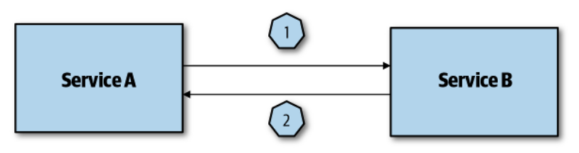
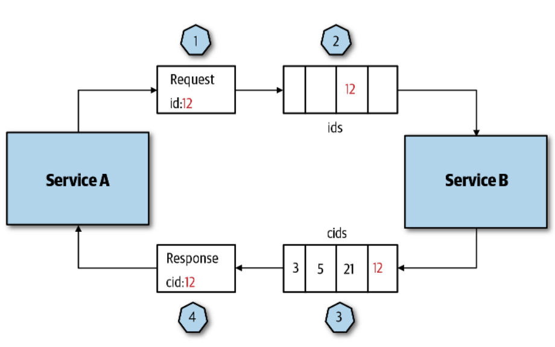
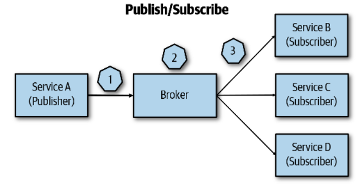

# Designing Cloud Native Applications

*Application architectures are a result of unique business requirements.*

Next we briefly describe important pillars for designing cloud native
applications.

## Important Design Pillars

### Operational Excelence

Regards how you build, run, deploy, and monitor your application.

*Automate everything*: Build continous deployment pipelines that allow you to
automatically deploy your infrastructure from the IaC files.

*Declarative infrastructure*: Declare your infrastrcuture in a IaC tool (such as
Terraform) and put it under source control (Git);

*Monitor everything*: Monitor every aspect of your application, inlcuding global
events that don't concern individual services, and the individual services.

*Document everything*: Pretty self explanatory, write documentation for your
apps and configs, it will make onboarding of new members a million times easier.

*Design for failure*: Cloud failures will happen! Design fault tolerance
systems.

### Security

*Cloud environments are safer than on-premises environments.*

Even though the above setence is true you are respnsible for security in the
cloud; while the provider is reponsible for security of the cloud. This is known
as the shared responsibility model. Thus *defense-in-depth* should be applied
throughout your architecture, always!

*Defense-in-depth*: Applying security mechanisms throughout the whole of a
system (spanning the every component).

For example, if you have a microservices application using containers and
Kubernetes applying defense in depth practices may contain the following tasks
(there can be many more of course that are ommitted here):

- *IAM*: Only allow each user in the cloud the minimum permissions to perform
  their tasks; use roles (temporary credentials) to acess resources; keep logs
  of every action a user performs.

- *Network/VPC*: Implement appropriate firewall and ACL rules for your VPC;
  seperate components (such as containers and DBs) in different subnets;
  determine if the cluster needs to be accessed from the Internet or a VPN is
  sufficient; make sure Kubernetes as role based access control enabled.

- *Code*: Apply branch protection rules; secure access to the repository; never
  store credentials in the code!

- *Container*: Add only what is neeed to the image and expose only necessary
  ports.

- *Container Registry*: Use a private registry with role based access control to
  the image.

- *Pod*: Ensure that container images can only be pulled from approved
  registries; provide Pods identities; use service meshes if you need intenral
  service to service security.

### Reliability and Availability

*Reliablity*: A reliable application can still function even if there are
failures underneath (usually regarding infrastructure).

*Availability*: The amount of time an application is up and working.

### Scalability and Cost

Scalability and cost go hand in hand. You should design scalable application
with cost efficiency in mind.

Even though cloud providers make it easy to scale an application (horizontally),
you still need to understand how the scaling works, for example:

- In a container scenario you want to optimize image size, if a new containers
  need to be spun off the image needs to be downloaded and this can add a lot of
  overhead if the image is large (even if the download is hapening in the cloud
  network). This is specially important in burst scenarios.

- In a function scenario if there are many functions calls acessing concurrently
  another service such as a DBMS, connections might be maxed out, resulting in
  slowing of performance.

## Traditional Architectures vs Cloud Native

Traditional architectures (monolithic applications) are *sateful* by nature.
They scale vertically most of the time due to being very hard to horizontally
scale stateful apps.

Cloud native applications are *stateless* by nature. They scale horizontally
most of the time (are elastic).

## Functions vs Containers

When building a cloud native application one the first decisions is wether to
start with containers (services packaged in containers) or functions. Functions
excel in short lived one off tasks. Containers are better suited for long
computational tasks. Most of the time a hybrid adoption between the two works
great.

### Important Function Characteristics

- They are short lived (AWS Lambda caps the execution at 15 minutes).

- Don't allow the choosing of specialized hardware for execution.

- They are stateless and communicate asynchronously through message queues. As a
  result a lot of data is passed in the network which can incur in performance
  losses.

- They have a pay per execution time model, thus you need to factor network
  times eventing costs, etc. You can save costs but if your application scales a
  lot you can incur in extra charges.

- They can be hard to debug and test (some FaaS runtimes are not portable to
  local development environments).

## API Design and Versioning

*API*: In the cloud context, it's the interface services use to communicate with
each other. Or, in other words, the stable documented contract a service exposes
to others.

Always try to use *semantic versioning* (major.minor.patch).

Since services communicate through APIs design and versioning are very
important. In terms of versioning there are three main approaches:

- *The knot*: Forces consumers to use a specific version of the API. When the
  API upgrades it's consumers need to also upgrade. It's very costly and
  inneficient, it burdens service consumers with the need to upgrade once a new
  version of the API is deployed.

- *Point-to-point*: Consumers upgrade the API when they need to. When new API
  versions are relased they don't force the update to the users. Although, this
  is costly to the API developer since older versions still need to be
  maintained.

- *Compatible versioning*: All consumers talk to the same API version. The API
  is backwards compatible and other versions are deprecated. A backwards
  compatible API is complex to develop, and if developers choose to commit to
  this model from the start they cannot break it (otherwise consumers will stop
  functioning properly).

It's very important to be able to monitor the API and API versions used by
consumers. This will help you decide when to deprecate old versions.

*Deprecation*: The endpoint still works but there is a better one to use
(documentation of the API usually highlights deprecated endpoints). The
deprecated endpoint can be removed when all the consumers stop using it (hence
why monitoring is important), or in a specific date with warning to the
consumers. Deprecation is kinda of like a signal "this works but start migrating
away".

## Service Communication

*Internal communication*: Between the services inside a cluster
(service-to-service, in the case of Kubernetes, pod-to-pod communication).

*External communication*: Anything that is external to the cluster, for example
traffic to a DBMS, or the Internet.

### Protocols

For external communication HTTP is the main protocol used (Websockets can also
be used).

For internal communication more performant options are available such as gRPC
(runs over HTTP/2). When event driven designs are in place however, message
protocols are employed: such as AMQP, or MQTT (both use WebSockets over TCP).

### Idempotency

*Idempotency*: Being able to run the same operation multiple times without
changing the result.

Design communication to be idempotent: if the same message ends up in a service
twice (because of a failure or retry policy) the service needs to produce the
same result. A good way to ensure this is to add a UUID to the message, the
service only processes if the IDs are different (i.e, you check if the message
with that UUID has already been processed).

### Request/Response and Pub/Sub

They are the two main mechanisms in service communication.

*Request and Response*: Can be implemented synchronously or asynchronously with
message queues. The client sends a request and waits for the response from the
server.

Synchronous request and response:

Asynchronous request and response:

*Publisher Subscriber*: A publisher sends a message to a topic which may have
more than one subscriber. The broker delivers the message to the subscribers and
the subscribers.

### Asynchronous Messaging

In general synchronous request and response tightly couples services, while
publisher subscriber does not. In a cloud native environment asynchronous
messaging patterns (such as the pub/sub) are the most common and should be used
and abused!

## Gateways

A gateway sits between the clients requests and the application's services. It
can be used in different ways and perform different functions:

*Routing*: They can act as a reverse proxy and route the client's requests to
the appropriate service.

*Aggregation*: The gateway is responsible for receiving the client request and
sending the multiple necessary requests to the services (at the same time); then
receive the service's requests and aggregate them into one response to be sent
back to the client. This can put a lot of load in the gateway and a seperate
aggregation service may be needed in some cases.

*Offloading*: Gateways can be used to offload taks that are common to all
services inside the application. The common here is very important, business
logic should not be present in the gateway. The offloaded tasks often include:

- Authentication and authorization
- SSL offloading
- Rate limiting and retry policies
- Caching
- Compression
- Logging and monitoring

It's very important to take into account the scalability of a gateway, since
it's the primary endpoint for receiving and responding client's requests.
Gateways can become a bottleneck if not properly scaled. They should also be
fault tolerant of course.

## Egress