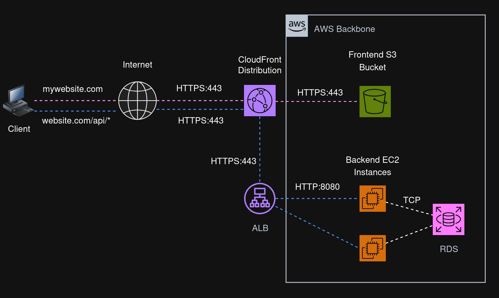
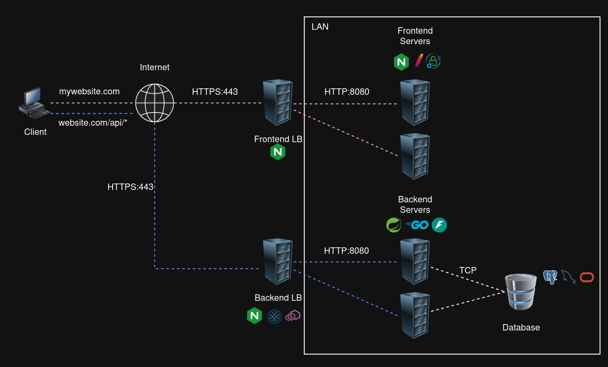

## Frontend Applications

**Frontend App**: A frontend app is ultimately just static files: HTML, CSS,
JavaScript and assets (images, fonts, videos, etc). The way a frontend app gets
served to the browsers can vary depending on the type of frontend and the
overall architecture. What happens is that the browser pretty much just
downloads those static files to your local machine and runs them (the browser
understands HTML, CSS, Javascript).

Two questions define every frontend architecture:

1. Where and when is the HTML produced?
2. What service hands the files to the browser?

### Types of Frontends

| Type                                   | Description                                                                                                                                                                                                                                |
| -------------------------------------- | ------------------------------------------------------------------------------------------------------------------------------------------------------------------------------------------------------------------------------------------ |
| Single Page Application (SPA)          | SPAs are heavilly javascripted applications. The browser usually reads a single index.html file that contains a big JavaScript bundle. The JavaScript app then runs entirely on the browser routing requests to a backend API for example. |
| Server Side Rendered Application (SSR) | SSRs are greate for SEO apps. The HTML is rendered and served by a server to the browser, usually with minimal javascript.                                                                                                                 |
| Static Sites (SSG)                     | Completly static files HTML are served to the browser which reads them.                                                                                                                                                                    |

## Architectures

### SPA + Separate API

This is one of the most common types of architecture when building a web
application, an SPA plus a seperate API. Here the SPA represents the frontend
application that get's delivered to your browser. It's commonly built using
frameworks like React or Angular. So initially the client (your browser)
requests this SPA application (which is just static files) from somewhere, then
the JavaScript side of things takes care of making requests for data to your
backend API. Backend APIs are commonly built using frameworks like Spring or FastAPI.

So there are usually two request flows, one for the SPA and several for the API
calls that your SPA may make. Commonly the frontend and backend are deployed as
separate artifacts and handled by different teams.

The following diagrams represent different ways you can deploy the frontend SPA
and the backend API. The first one represents a very common approach by using a
cloud provider (in this case AWS). The second approach assumes you manage
everything yourself. The purple lines represent the first request the
client/browser makes to get the frontend app (SPA). The blue lines are made from
the already builded SPA to the backend API.

