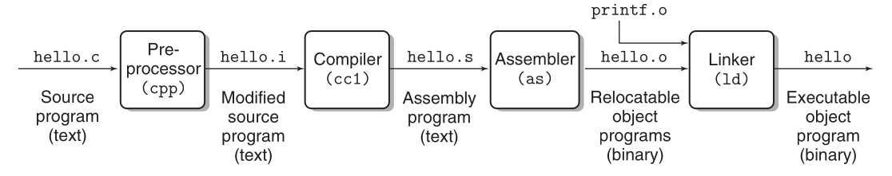

## The Compilation System

*Preprocessing*: Take the source code (.c file) and process directives starting with"#". For example
directly including headers (stdio.h). Produces a .i file.

*Compiling*: Take the .i file and produce assembly instructions for the CPU.

*Assembling*: Translate the assembly program into machine code, raw bits. This produces a shareable
object within the system.

*Linking*: Dynamically link required libraries in the program (stdio, stdlib, etc). Produces the
final executable object.

***

### Main Hardware Components of a System

*CPU*: Responsible for executing instructions in main memory. It operates according to it's
instruction set architecture (ISA), which are simple actions performed against main memory or in the
CPU itself. The ISA is based on the microcode which actually describes how the processor functions
at the hardware level. The CPU also contains registers which store data, the register size is equal
to the word size of the system. Important and common registers include the PC, registers inside the
ALU, and the stack registers.

*Main Memory*: An array of bytes that stores data and instructions to be executed by the CPU.
Programs that are running have all their instructions and necessary data on memory. The kernel is
also present in memory at all times, it's the first thing that it's loaded into memory by the
bootloader.

*Buses*: Carry word sized byte chunks between different components of the system, for example
between the CPU and memory, between CPU and I/O devices.

*Disk*: Also known as secondary memory. Stores data permanently. More storage but slower.

***

### Memory Hierarchy

Bigger storage capacity implies slower access.

*Volatile memory*: Erases data if there is no current (power). Main memory is volatile memory,
aswell as CPU registers and caches. Example technologies: DRAM, SRAM.

*Non-volatile memory*: Permanently keeps data even when power is turned off. Secondary memory is
non-volatile. Example technologies: NAND Flash, PROM, EPROM, Magnetic Storage, Optical Storage.

***

*Hyperthreading*: The concept of a single CPU executing multiple tasks. This is allowed by the
replication of certain hardware components of the CPU such as the program counter (PC) and register
file.

