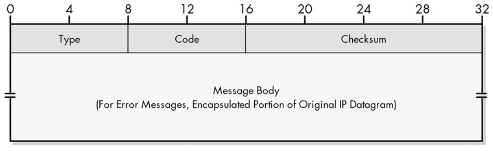
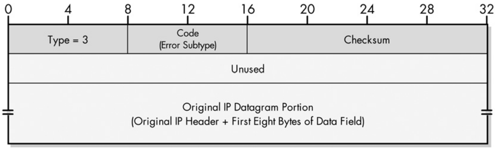
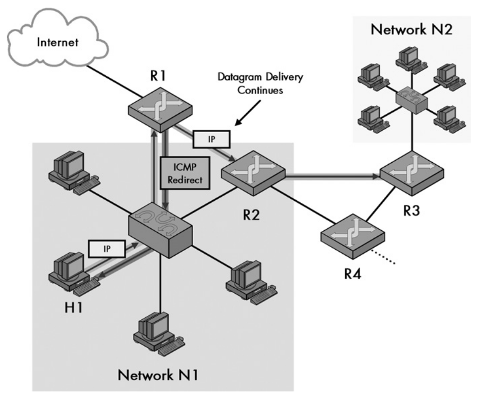
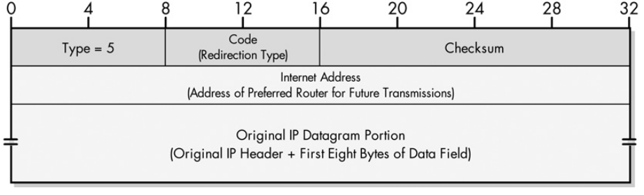
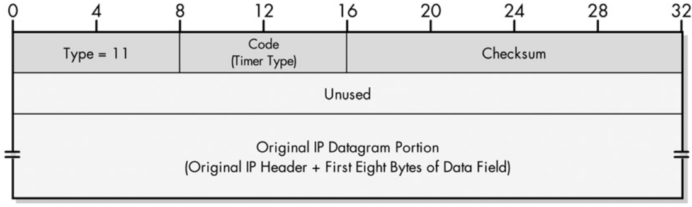

# Internet Message Control Protocol (ICMP)

ICMP performs testing, diagnostic and error reporting functions that IP doesn't
have. It is supposed to be implemented hand in hand with IP. ICMP is very simple
much of it's functionality may be resumed by the sending of specific control
messages to devices.

ICMP is encapsulated as the payload of IP datagrams.

ICMP itself defines message types for its purposes, but since ICMP is designed
to be very expandable other protocols may also define ICMP message types to
achieve their full functionality.

ICMP messages can only be sent to the original source device and not
intermediate devices it passed through (routers or firewalls for example). This
is because the source address in the IP datagram itself is unchanged and
corresponds to the original host that sent the datagram.

## ICMP Message Classes, Types and Codes

ICMP can be organized into a hierarchy of the following:

*ICMP Message Class* : An ICMP message can either be of the class
*informational* or *error*. ICMP error messages always contain a portion of the
original IP datagram: the IP header + 8 bytes of payload.

*ICMP Message Type* : Describes the type of message.

*ICMP Message Code* : Provides an aditional level of detail regarding the
message type.

NOTE: Devices are note mandated to perform any action upon receiving a ICMP
error message. Although, most protocols perform some actionin response to a
specific ICMP error message type.

ICMPv4 Error Messages:

| Type Value | Message Name            | Description                                                                                                |
| ---------- | ----------------------- | ---------------------------------------------------------------------------------------------------------- |
| 3          | Destination Unreachable | Indicates that the datagram could not be delivered to the destination, the code provides more information. |
| 5          | Redirect                | Informs the host that a better route is available for use (it sends the IP of another better router).      |
| 11         | Time Exceeded           | Sent when datagram is discarded prior to its TTL field reaching 0.                                         |
| 12         | Parameter Problem       | Miscellaneous problem indicated by the code field.                                                         |

ICMPv4 Informational Messages:

| Type Value | Message Name         | Description                                                                    |
| ---------- | -------------------- | ------------------------------------------------------------------------------ |
| 0          | Echo Reply           | Response to an echo request, used to test connectivity.                        |
| 8          | Echo (Request)       | Request to test connectivity.                                                  |
| 9          | Router Advertisement | Sent by routers to nearby hosts to advertise their IP, and their capabilities. |
| 10         | Router Solicitation  | Used by hosts to prompt listening routers to send a router advertisement.      |
| 13         | Timestamp (Request)  | Request for information metrics about the network.                             |
| 14         | Timestamp Reply      | Reply to a timestamp request.                                                  |
| 17         | Subnet Mask Request  | Request for a host to send their subnet mask.                                  |
| 18         | Subnet Mask Reply    | Reply to a subnet mask request.                                                |
| 30         | Traceroute           | Used in the traceroute functionality. It helps enhance it.                     |

## Limitations on ICMP Messages

These apply mostly to error class messages since the informational ones are
already controlled by the device who sends them. This is because error class
messages are responses to a certain type of situation.

  * ICMP error responses are generated only for the first fragment of an IP
    datagram (if there was an error with the first fragment there is no point
    sending multiple ICMP messages for the other fragments).

  * ICMP error messages cannot be sent in response to other ICMP error messages,
    this prevents infinite loops.

  * ICMP error messages cannot be generated in reponse to a broadcast or
    multicast address (eg. a broadcast is sent to 2000 hosts, if they were to
    send an ICMP error message in response it would be catastrofic).

## ICMP Common Message Format

Both ICMPv4 and ICMPv6 present the same common format:

## ICMPv4 Error Message Types

The original ICMPv4 standard, RFC 792 defined 5 different error messages (with one now
obsolete, the source quench).

### Destination Unreachable (Type 3)

The destination unreachable message format:

There are many reasons why an IP datagram cant reach its destination. The destination
unreachable type is very generic, it's the code that really provides insightful
information.

Destination Unreachable Subtypes:

| Code | Message Subtype                                                       | Description                                                                                                                                                   |
| ---- | --------------------------------------------------------------------- | ------------------------------------------------------------------------------------------------------------------------------------------------------------- |
| 0    | Network Unreachable                                                   | The destination network (specified in the network ID of the datagram) could not be reached, usually a routing error, but can also be caused by a bad address. |
| 1    | Host Unreachable                                                      | The destination network was reachable but the host in the network wasn't. Again, usually a routing error.                                                     |
| 2    | Protocol Unreachable                                                  | The protocol specified in the protocol field is invalid for the destination host.                                                                             |
| 3    | Port Unreachable                                                      | The specific port in UDP or TCP header is invalid.                                                                                                            |
| 4    | Fragmentation Needed and DF Set                                       | A router discards the packet if it’s too large and the DF (Don't Fragment) bit is set. Used in Path MTU Discovery to establish the minimum MTU along a route. |
| 5    | Source Route Failed                                                   | Generated if a source route is specified in an IP datagram option, but the router couldn't forward the datagram.                                              |
| 6    | Destination Network Unknown                                           | Not used, code 0 is used instead.                                                                                                                             |
| 7    | Destination Host Unknown                                              | IP datagram arrived at the network but the destination host is not known. Usually means a bad address.                                                        |
| 8    | Source Host Isolated                                                  | Obsolete.                                                                                                                                                     |
| 9    | Communication with Destination Network is Administratively Prohibited | Used when communication with the destination network is blocked by an ACL.                                                                                    |
| 10   | Communication with Destination Host is Administratively Prohibited    | Used when communication is allowed in the destination network but not that particular host, usually blocked by an ACL as well.                                |
| 11   | Destination Network Unreachable for Type of Service                   | Used when the specified destination network is unable to provide the ToS indicated in the IP datagram header.                                                 |
| 12   | Destination Host Unreachable for Type of Service                      | Used when the specified host is unable to provide the ToS indicated in the IP datagram header.                                                                |
| 13   | Communication Administratively Prohibited                             | Used when the IP datagram is blocked (ACL) due to its contents.                                                                                               |
| 14   | Host Precedence Violation                                             | Sent by the first-hop router when the precedence value (priority) in the ToS field is not allowed.                                                            |
| 15   | Precedence Cutoff in Effect                                           | Sent by a router when the precedence value (priority) in the ToS field is lower than the minimum allowed.                                                     |

### Redirect (Type 5)

Redirect messages are sent back to host when a router receives a datagram that has a better
router option. The router will still forward the datagram to the destination, but it will
send the ICMP message to the host telling it another better router should be used. Usually
happens when there is more then one router available at the LAN of the host, and the host
chose a middleman router when it could've sent the datagram to a router that is directly
connected to the intended destination network.

This is the format of a redirect message:

Redirect Codes:

| Code | Message Subtype                                    | Description                                                                                                                                                        |
| ---- | -------------------------------------------------- | ------------------------------------------------------------------------------------------------------------------------------------------------------------------ |
| 0    | Redirect Datagrams for Network (or Subnet)         | Sent not only to the host who originally sent the datagram, but all hosts in it's network or subnetwork. It is considered obsolete now because of CIDR addressing. |
| 1    | Redirect Datagrams for the Host                    | Redirect future datagrams of the host who originally sent the datagram.                                                                                            |
| 2    | Redirect Datagrams for TOS and Network (or Subnet) | Same as 0 but for datagrams with the same TOS. Again, obsolete.                                                                                                    |
| 3    | Redirect Datagrams for TOS and Host                | Same as 1 but for datagrams with the same TOS sent by the host.                                                                                                    |

It's important to keep in mind that redirect messages are auxiliary and are not ment to
define the routing process in the Internet. They simple help hosts check for a better
first-hop router.

### Time Exceeded (Type 11)

A time exceeded ICMP message is sent when a router receives a datagram with a TTL=0.
The router drops the datagrams and sends the ICMP message to the source.

A code of 1 means the TTL reached 0 (sent by routers). A code of 1 means the fragment
reassembly time has been exceeded (usually sent by the end hosts themselves).

## Parameter Problem (Type 12)

Sent when the router found a parameter problem in the IP datagram's header. This
message type is very generic and simply indicates which field in the header caused
the problem, this is done with a special pointer in the case of messages with code 0.

Parameter Problem Codes:

| Code | Message Subtype             | Description                                                                                                                            |
| ---- | --------------------------- | -------------------------------------------------------------------------------------------------------------------------------------- |
| 0    | Pointer Indicates the Error | The normal ussage of this type of message. A pointer is included in the message which indicates which header field caused the problem. |
| 1    | Missing a Required Option   | Indicates a missing option in the IP datagram and which should be included.                                                            |
| 2    | Bad Length                  | The length of the overall IP datagram is incorrect.                                                                                    |

NOTE: The pointer field is only 8 bits wide but this is enough to indicate which field
caused the error in the IP datagram.

