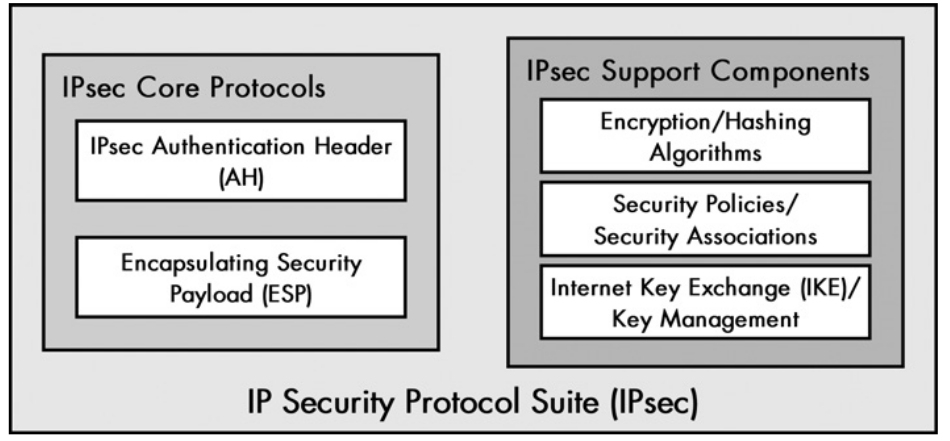
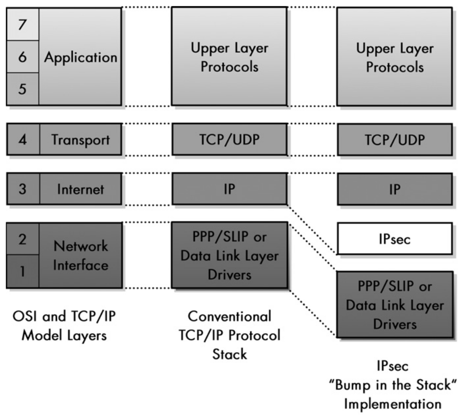
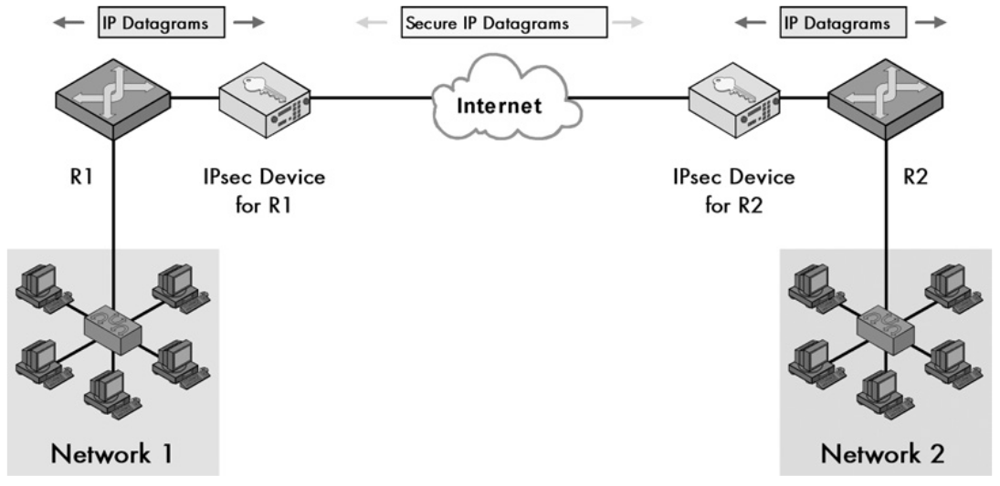
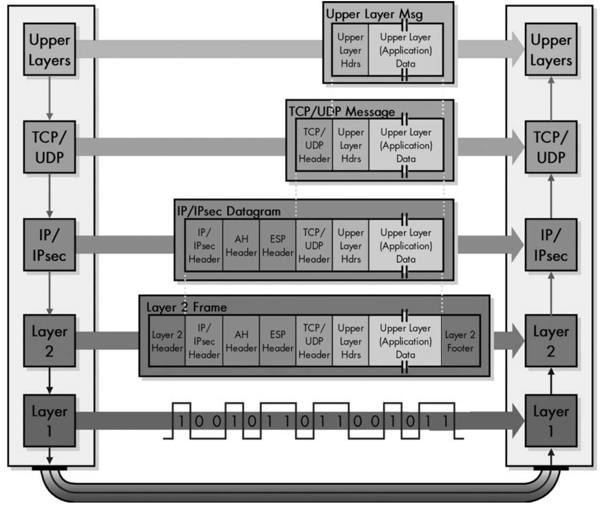
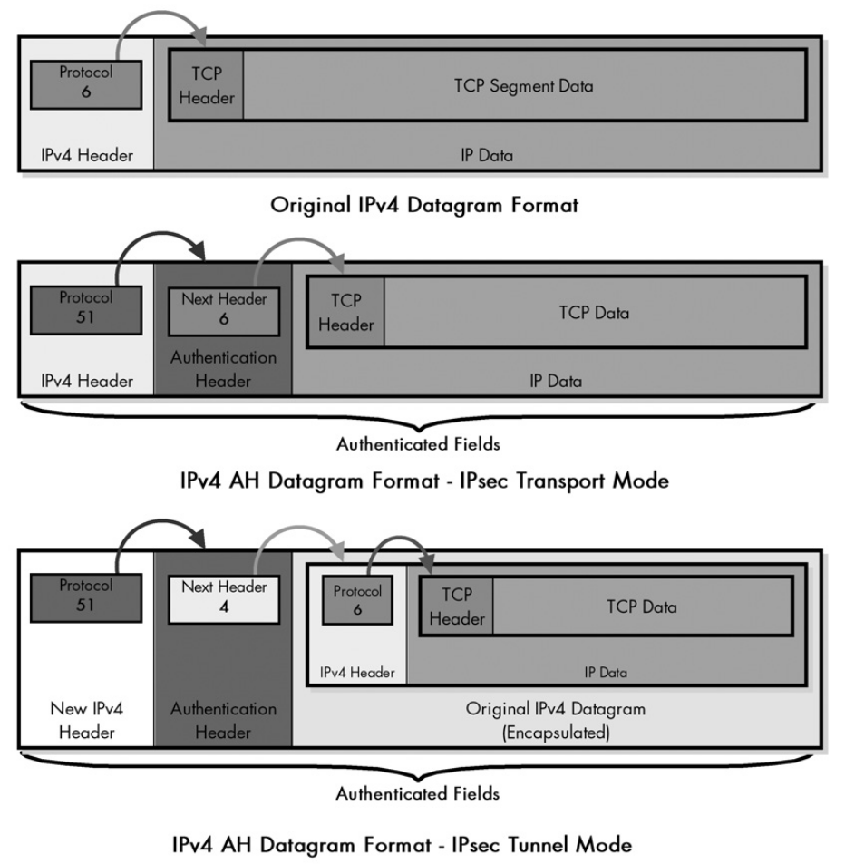
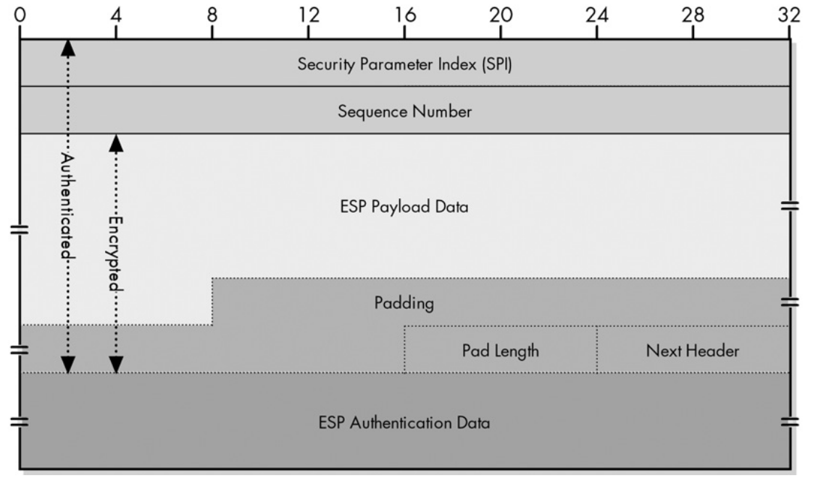

# IP Security Protocols (IPsec)

Security is already commonly applied at application layer protocols through the
use of SSL/TLS. IPsec relates to security protocols designed to work at the
network layer. Why? An extra layer of security is important, and because many
application protocols where not designed to work with SSL/TLS in the first
place.

## IPsec services and functions

IPsec is not a single protocol but a set of protocols and services that provide
security at the netwrok level.

* Encryption of user data.
* Two security modes: transport and tunnel.
* Authentication of the integrity of messages to ensure they are not changed
  while hoping through routers.
* Ability for devices to negotiate security algorithms and keys.
* Protection against certain types of attacks such as replay attacks.

## IPsec Standards

As said, IPsec is a collection of protocols and standards. Here are the
important related RFC's.

| RFC number      | Name                                                               | Description                                                                             |
| --------------- | ------------------------------------------------------------------ | --------------------------------------------------------------------------------------- |
| 4301            | Security Architecture for the Internet Protocol                    | Replaces RFC 2401. Defines the IPsec architecture, including SAs and SPD/SAD.           |
| 4302            | IP Authentication Header (AH)                                      | Replaces RFC 2402. Describes AH for integrity and origin authentication.                |
| 4303            | IP Encapsulating Security Payload (ESP)                            | Replaces RFC 2406. Defines ESP for confidentiality, integrity, and authentication.      |
| 7296            | Internet Key Exchange Protocol Version 2 (IKEv2)                   | Replaces RFCs 2409 and parts of 2408/2412. Standard protocol for key exchange in IPsec. |
| 4306 (obsolete) | IKEv2 initial spec (now replaced by RFC 7296)                      | Earlier IKEv2 spec, replaced by RFC 7296.                                               |
| 2408 (obsolete) | Internet Security Association and Key Management Protocol (ISAKMP) | Replaced by IKEv2 (RFC 7296); previously handled SA and key negotiation.                |
| 2412 (obsolete) | The OAKLEY Key Determination Protocol                              | Now considered obsolete; concepts folded into IKEv2.                                    |

## IPsec General Operation

The image bellow represents the IPsec protocol suite. The core protocols work by
adding a header and possibly other fields related to IPsec.

NOTE: ESP also adds a trailer.

### IPsec Authentication Header (AH)

Used in legacy sistems or for internal use.

* Provides authentication services for IP, i.e, ensures that the sender is
  really who he says he is.
* Ensures the integrity of the IP datagram, i.e, intermediate routers don't
  change it.
* Protects against replay attacks: a message is captured and resent by an
  unauthorized user.
* Default port: 51

### Encapsulating Security Payload (ESP)

It's the most common protocol for IPsec today.

* It encrypts the payload of the IP datagram.
* It also provides integrity and optional authentication just like AH.
* Default port: 50

### IPsec Support Components

In order to function properly IPsec needs more than the core protocols:

* Encryption and Hashing algorithms need to be defined between the hosts that
  want to exchange information.
* Because IPsec is flexible in the way the security is implemented, Security
  Policies and Security Associations must be defined aswell.
* Means for exchanging the keys used for decrypting, this is provided by IKE:
  port 500 (IKE v1/v2) or 4500 (IKE with NAT-T). *Security policy* : Defines
  which traffic in the network should be protected using IPsec features. In
  general, it's a rule that says what should be protected. For example, all
  subnets and hosts of 10.0.0.0/26. *Security association* : An agreement
  between the devices that tells exactly how they should protect the traffic,
  example: use the Arg2 algorithm for integrity (hashing) and RSA for
  encryption; lifetime of keys; mode of operation (tunnel or transport);
  sequence numbers to protect against replay attacks; etc. To establish an SA
  between two devices the IKE must be used first (occurs in two phases).

## IPsec Implementation

Usually divided in two types:

*End-Host Implementation* : This means implementing IPsec in every single host
on the network. This offers very high security but it's more complex and harder
to manage.

*Gateway-To-Gateway (Router) Implementation* : Implements IPsec in routers.
Secure exchange is done between routers that implement IPsec. Much more easier
to manage and enough in most cases.

## IPsec Architecture

Categorized in three types.

### Integrated Architecture

This implements IPsec features directly on the hosts. It changes their IP
implmentation (OS kernel level). It provides the most clean and secure solution
however it's highly impractical and complex.

### Bump In The Stack (BITS) Architecture

Adds an extra layer the is in charge of implement IPsec and passing the IP
datagrams to the data link layer. Typically done by inserting a software module
or driver in the OS.

### Bump In The Wire (BITW) Architecture

Adds a capable hardware device to the network that implements IPsec. This
provides retrocompatibility to routers that don't have IPsec functionality (more
costly and complex).

BITS and BITW are very similar, they do the same thing: one at software level,
the other at the hardware level.

## IPsec Modes: Transport and Tunnel

IPsec modes are closely related to the AH and ESP core protocols. The modes
describe which parts of the IP datagram are protected and how the are arranged.

It's possible to use both AH and ESP in a mode, when this happens the AH header
always appears before the ESP header.

### Transport Mode

Works with AH and/or ESP, the headers are added between the transport layer
protocol (TCP or UDP) and the IP protocol. In essence the data is passed from
the transport layer to IPsec and then to IP.

Associated with the Integrated Architecture.

### Tunnel Mode

Used to protect an already encapsulated IP datagram. It adds AH and/or ESP
headers after the original IP header. Then another IP header is added to this
entire new IP datagram.

Very common in VPN implementations.

Associated with BITS and BITW Architectures.

## IPsec Security Constructs

* Security Policies
* Security Policy Databases (SPD)
* Security Associations
* Security Association Databases (SAD)
* Selectors : Rules for selecting which IP datagrams the SA should be applied
  to.
* Security Parameter Index (SPI)

### Security Association Triples and SPI

Devices that communicate using IPsec must establish an SA. *SA's are
unidirectional*. Meaning the traffic going from A to B may use a different SA
than traffic going from B to A.

SA's are identified by a three parameters called a triple:

*Security Parameter Index (SPI)* : 32 bit number used to identify a particular
SA. It is placed in the AH or ESP header. Used for the recepient to know which
SA governs the datagram.

*IP Destination Address* : The destination address where the SA is applied.

*Security Protocol Identifier* : Specifies if the SA is intended for AH or ESP.
If both are used they must have seperate SA's.

## IPsec Authentication Header (AH)

Allows the receiver to verify the authenticity of the sender. It works by
placing an header (different position wether in transport or tunnel mode) that
contains a *integrity check value (ICV)* computed based on the payload (using a
hashing algorithm). The recipient uses this value to ensure the data hasn't been
changed or corrupted.

| Field               | Description                                                                                                                                                |
| ------------------- | ---------------------------------------------------------------------------------------------------------------------------------------------------------- |
| Next Header         | Points to the next protocol header.                                                                                                                        |
| Payload Len         | Indicates the length of the AH itself not the IP datagram payload.                                                                                         |
| Reserved            | Not used, set to 0.                                                                                                                                        |
| SPI                 | Security Paramter Index, when combined with the destination address and the security protocol   (which is AH here of course) identifies the SA to be used. |
| Sequence Number     | After the SA is established this number is set to 0 and incremented by one for each datagram sent. It prevents replay attacks.                             |
| Authentication Data | Contains the result (ICV) of the hashing algorithm used by the AH protocol.                                                                                |

NOTE: The size of the authentication data field is variable but it must be a
multiple of 32 bits. It is this way because AH supports different hashing
algorithms and datagram lengths of course.

## IPsec Encapsulating Security Payload (ESP)

ESP is the most common protocol for IPsec today, besides an optional
authentication option it provides encryption of IP datagrams. Similar to AH it
places an header (different positions acording to the mode) that contains
certain fields. But also places a trailer and the optinal auth data.

| Section                 | Field               | Description                                                                                                                                               |
| ----------------------- | ------------------- | --------------------------------------------------------------------------------------------------------------------------------------------------------- |
| ESP Header              | SPI                 | Security Paramter Index, when combined with the destination address and the security protocol (which is ESP here of course) identifies the SA to be used. |
| ESP Header              | Sequence Number     | After the SA is established this number is set to 0 and incremented by one for each datagram sent. It prevents replay attacks.                            |
| Payload                 | Payload Data        | The playload that is encrpyted (full IPv4 datagram or just IPv4 payload depending on tunnel or transport mode).                                           |
| ESP Trailer             | Padding             | Variable padding (multiple of 32 bits) needed for encryption blocks                                                                                       |
| ESP Trailer             | Padding length      | Length of the padding block                                                                                                                               |
| ESP Trailer             | Next Header         | Points to the next protocol header.                                                                                                                       |
| ESP Authentication Data | Authentication Data | Contains the result (ICV) of the authentication algorithm used by the ESP protocol.                                                                       |

