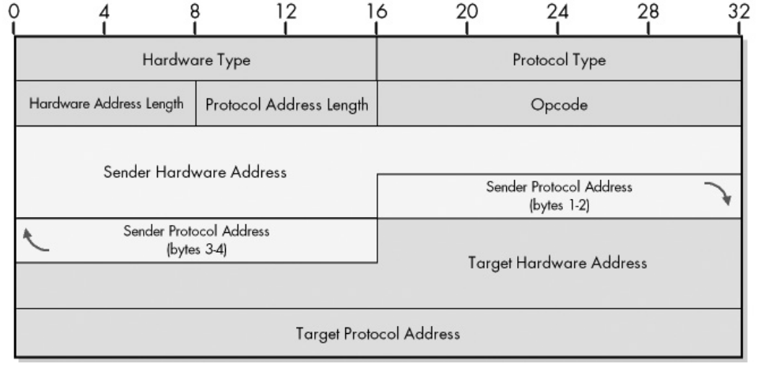
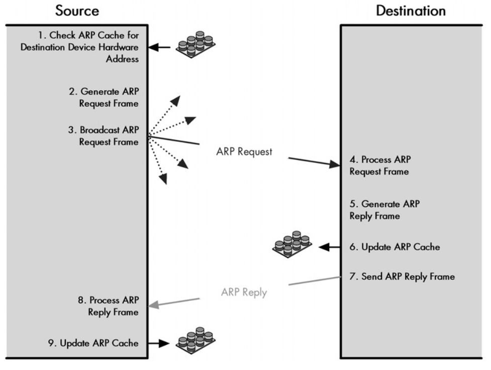

# Address Resolution Protocol (ARP)

The actual transmission of data between any two internetworked devices occurs at
the data link and physical layers. The layer 3 provides a logical connection,
but it's the actual underlying layer 2 responsible for transmiting the data
between directly connected devices. Thus, layer 3 addresses (IP addresses) are
not enough. The identification of the physical network interfaces at layer two
is done with a layer 2 address, most commonly, the MAC address. *Address
resolution* is the process that resolves the actual layer 2 address needed for
communication between the two directly connected hosts.

| Layer     | Address     | Size    | Example           |
| --------- | ----------- | ------- | ----------------- |
| Network   | IP address  | 32 bits | 192.168.75.2      |
| Data Link | MAC address | 48 bits | 00:1A:2B:3C:4D:5E |

NOTE: MAC addresses apply only to IEEE 802 networks, of which Ethernet and Wifi
are included. But there may be a different underlying physical network that does
not use MAC addresses, on the Internet it's very rare though.

Remember, when a device sends a packet to another and it travels the Internet,
the packet will travel many different physical networks from hop to hop until it
reaches the destination (starting with the local one). Each hop knows the
ultimate destination trough the IP address, but it needs to know where to
physically send the data, that is, the next hop's interface. For that, each hop
that receives the packet will also need the directly connected MAC address of
the next one's interface. So, address resolution occurs at every hop a packet
travels.

ARP (RFC 826) is the main address resolution protocol used on the Internet. It's
used to match IP addresses to the underlying data link MAC addresses. It works
by having the IP device send a broadcast ARP message on the LAN to discover the
destination's MAC address. It is supplemented by caching methods since always
sending broadcasts is highly inneficient.

## ARP Message Format and Operation

ARP works on a *request reply* pair of transmissions on the *local network
(LAN)*. When the source host needs to send an IP datagram, after packaging it,
it delegates responsability to it's ARP software to discover the MAC address of
the source, needed for physical transmission.

*ARP Request*: For the ARP request the sender is the source host (meaning the
sender's fields will be filled with the source's addresses), and the target is
the destination host (for the initial request the target hardware address is all
zeros since the source host does not yet know the destination's MAC address).

*ARP Reply*: For the ARP reply the sender is the destination host (meaning the
sender's fields will be filled with the destination's addresses), and the target
is the source host.

| Field                   | Description                                                                                 |
| ----------------------- | ------------------------------------------------------------------------------------------- |
| Hardware Type           | A code indicating the type of link layer technology/protocol used (most common is Ethernet) |
| Protocol Type           | A code indicating the network layer protocol (most common is 0x0800 for IPv4)               |
| Hardware Address Length | The length of the hardware address (link layer address)                                     |
| Protocol Address Length | The length of the protocol address (network layer address)                                  |
| Sender Hardware Address | The hardware address of the sender message.                                                 |
| Sender Protocol Address | The protocol address of the sender.                                                         |
| Target Hardware Address | The hardware address of the target (all 0 when first requesting).                           |
| Target Protocol Address | The protocol address of target.                                                             |

These are the steps performed in a ARP transaction:

1. Source checks cache, if it has the address it needs, it skips to step 9.
2. Source creates an ARP request filling it's own IP and MAC address (sender
   protocol address, and sender hardware address fields), aswell as the
   destination's IP address (traget protocol address field).
3. Source broadcasts an ARP request.
4. Hosts receive and check the request dropping it if the destination's IP
   address (target protocol address field) doesn't match theirs.
5. Destination creates an ARP reply filling in it's own MAC address (on the
   sender hardware address field, since the destination is the one sending the
   reply).
6. Destination caches the source's IP and MAC address mapping for future
   communication.
7. Destination sends the ARP reply (unicast).
8. The source receives and processes the reply, storing the sender MAC address
   on the destination's hardware address. It then uses that address to send the
   IP datagram.
9. The source updates it's cache for future use.

