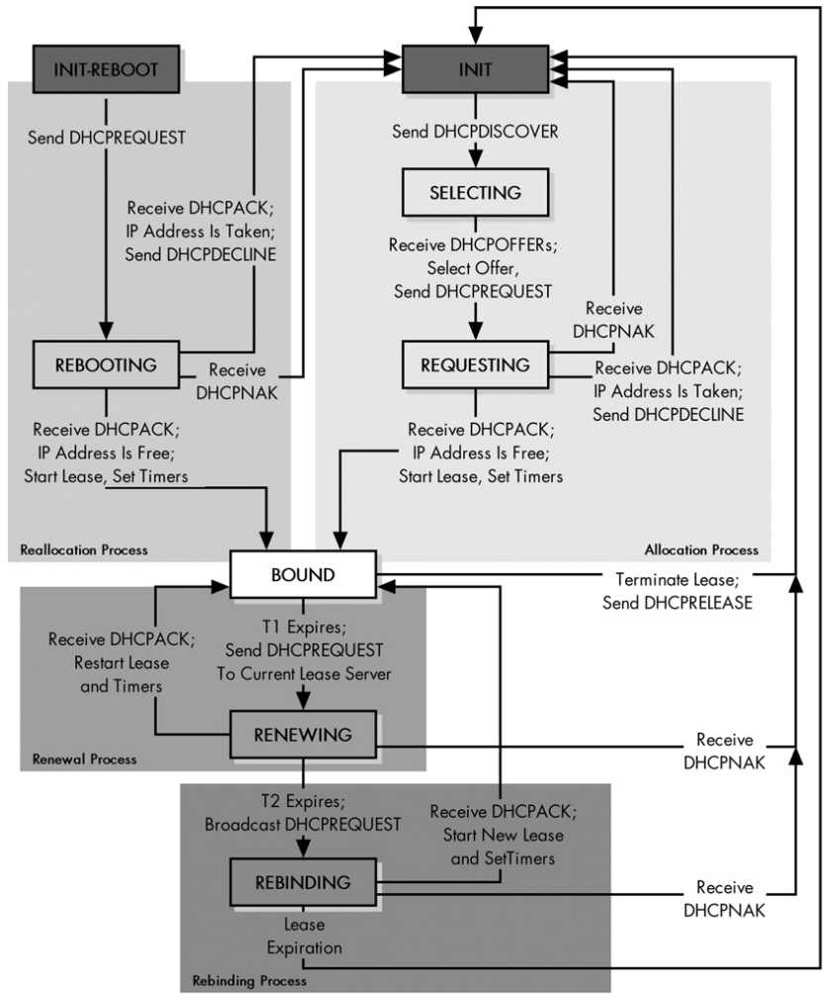
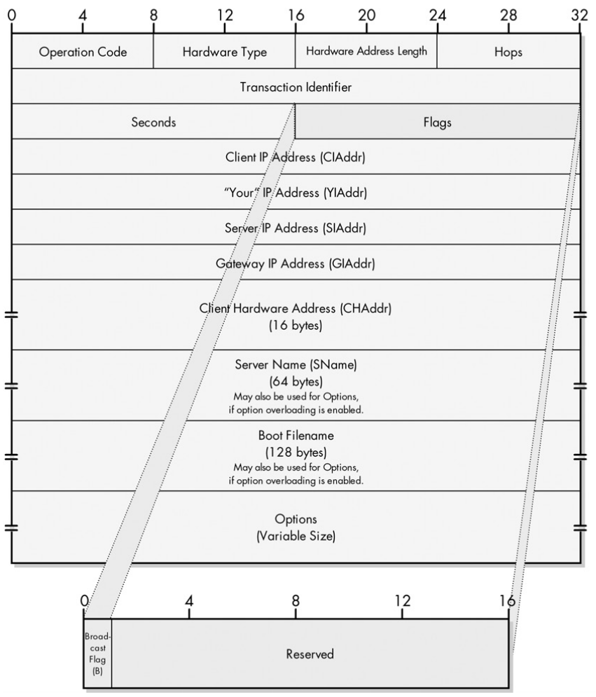
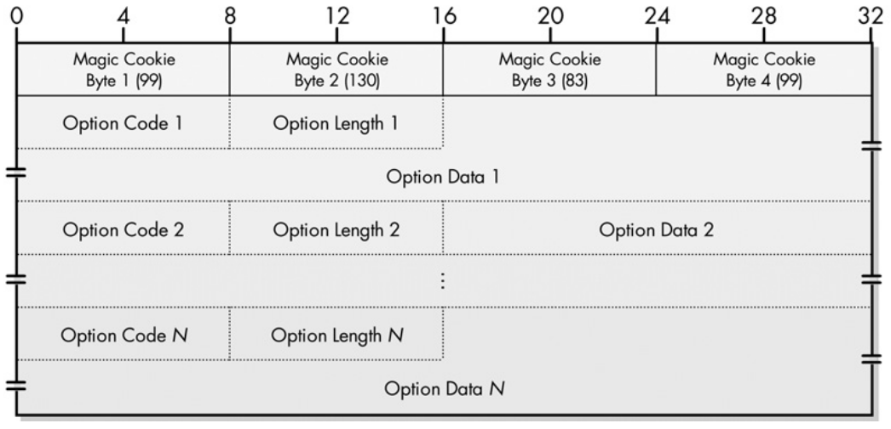

# Dynamic Host Configuration Protocol (DHCP)

DHCP is the standard protocol in the TCP/IP stack for configuring hosts on a
network

Information required by a host in order to be properly configured in a modern
network:

* An IP address  
* The address of the default gateway (the router)  
* Addresses of DNS resolvers  
* The MTU of the local network  
* What TTL value to use for IP datagrams

Hosts can be configured *statically* by a network administrator or *dynamically*
by a protocol (DHCP). When working dynamically usually a host sends a request to
the server in the LAN that contains the configuration parameters, the network
administrator configures the server.

## Dynamic Host Configuration Protocol (DHCP)

DHCP (RFC 2131) works at the application layer. DHCP is an improvement (and
built on top) of the older Bootstrap Protocol (BOOTP), which is itself an
improvement on the Reverse Address Resolution Protocol (RARP), which works at
the data link layer.

DHCP has two major components: an *address allocation* mechanism, and a
*protocol* that allows clients to *request DHCP servers for configuration
parameters* such as, the address of the default gateway, and addresses of DNS
resolvers. It is thus based on a client-server architecture, using UDP (remember
that DHCP is an application layer protocol and it needs a transport layer one to
run on) on port 67 for servers and on port 68 for clients.

Since DHCP runs over UDP, there is no realiable communication. Thus, clients
usually set retransmission timers for requests if they receive no response from
the server.

*DHCP Relay Agent*: A DHCP relay agent is reponsible for forwarding DHCP
requests and replies when the DHCP server is in a different network or
subnetwork than it's clients. This is needed because by default most requests
are broadcasts which do not cross routers. DHCP relay agents are usually routers
or layer 3 switches. When a relay agent receives a DHCP message it adds it's own
address to the *giaddr* field and forwards as unicast to the DHCP server.

## DHCP Address Allocation Mechanisms

*Dynamic Allocation*: IP addresses are *leased* for a particular amount of time
dynamically by the server from a *pool* of available addresses. The client asks
for an IP address and the server leases it. If the lease expires, the client can
renew it or asks for a new one. This allows efficient allocation of addresses
because if a client is not present on the network for a long time (unnused
address), the lease expires and the address returns to the available pool.

*Automatic Allocation*: The same as dynamic allocation but instead of having a
lease time, the address is assigned *permanently* by the server (uncommon
usage).

*Static Allocation*: Works just like in BOOTP, the network administrator
statically assigns an IP address to a certain host, the DHCP server assigns that
predifined address to the specific host. Static allocation is normally used for
servers and routers in the LAN, or other important devices. If most hosts have
capabilities of configuring a static address why use DHCP to assign them the
addresses in the first place? The answer is that it provides an administrative
benifit: the *centralization of all IP addresses within the DHCP server*.

## DHCP Leases

The DHCP server owns all the IP addresses, and *leases* them to clients for a
particular amount of time.

*Lease Length Policy*: Determines the amount of time a DHCP lease is valid for,
that is, the amount of time a particular IP address is valid for a client. The
lease length policy is configured in the DHCP server by a network administrator.
By default, clients request a *renew* of the lease when the lease time reaches
half.

Longer leases tend to be better for clients that probably wont move out of the
LAN. Shorter leases are better for clients that may disconnect quickly out of
the LAN.

### DHCP Renewal and Rebinding Timers

These timers are set as soon as a client receives a lease.

*Renewal Timer (T1)*: After this timer expires the client will try to renew the
lease. By default its 50% of the lease time. If the renewal is successful the
timers T1 and T2 are reset.

*Rebinding Timer (T2)*: After this timer expires the client will try to rebind
to another DHCP server. By default this timer is 87.5% of the lease, and of
course, its only triggered if the renewal is not successful (since T1 resets the
timers).

### DHCP Lease Ranges

These are setted up in DHCP servers they are basically a *pool* of addresses
that can be assigned to clients. A DHCP may choose to exclude some addresses of
the pool for the default gateway or servers that may need static addresses (for
example from the network 192.168.0.0/0 reserve 192.168.0.1 for default gateway
and have the rest of the pool available for clients: 192.168.0.2-192.168.0.254).

If there is more than one DHCP server in a LAN (and for redundancy and failback
reasons there should be) the best way to configure them is to assign a different
pool size to each other, this is called *non-overlapping* (however they can also
have the same *overlapping* pool, not recommended though).

### DHCP Lease Life Cycle

- *Allocation*: A client that has no active lease needs one allocated.  
- *Reallocation*: A client that reboots and has a lease will ask the DHCP server
  for reallocation.  
- *Renewal*: A client that has had his lease expired asks for a renewal.  
- *Rebinding*: If a renewal fails, the client will try to rebind to an active
  DHCP server so it can extend its lease.  
- *Release*: The client intentionally terminates its lease, releasing the IP
  address (for example if the client moves to a different network).

The following state machine diagram (also defined in the RFC) describes in
detail a lease lifecycle from the perspective of the client.

NOTE: Since DHCP is an application layer protocol using UDP, it also uses IP.
But some DHCP messages are sent even when the client does not have an IP address
(DHCPDISCOVER for example). This is where the 0.0.0.0 reserved address is used,
and in the DHCP context means that the client doesn't have an IP address yet.

## DHCP Parameter Configuration for Clients with Static Addresses

Sometimes a client just wants to request a DHCP server the configuration
parameters (such as default gateway and DNS resolvers). This usually happens
when the client already has a static address. To obtain the configuration
parameters they send a DHCPINFORM message (in broadcast or unicast).

The client will retry to send DHCPINFORM if there is no response from the
server. After a time period, if it still obtains no answer it will use default
configuration values.

## DHCP Messages

Here are the types of DHCP messages along with a general description and other info.

| Message      | Description                                                                                                           | Type Number | Op  |
| ------------ | --------------------------------------------------------------------------------------------------------------------- | ----------- | --- |
| DHCPDISCOVER | Sent by clients as *broadcast* to find DHCP servers.                                                                    | 1           | 1   |
| DHCPOFFER    | Sent by servers as *unicast* or *broadcast*, includes IP address and configuration parameters.                            | 2           | 2   |
| DHCPREQUEST  | Sent by clients as *broadcast* (or *unicast* if client is in RENEWING state) to inform the accepted lease.                | 3           | 1   |
| DHCPDECLINE  | Sent by clients as *unicast* when the IP in the lease is taken and not valid.                                           | 4           | 1   |
| DHCPACK      | Sent by servers as *unicast* to confirm the client's lease request.                                                     | 5           | 2   |
| DHCPNACK     | Sent by servers as *broadcast* (because IP is no longer valid) to decline the clients lease request (IP already taken). | 6           | 2   |
| DHCPRELEASE  | Sent by clients as *unicast* to release the current lease back to the server.                                           | 7           | 1   |
| DHCPINFORM   | Sent by clients as *unicast* that already have an IP address and just want the configuration parameters.                | 8           | 1   |

The DHCP message is built on top of the BOOTP message format, but the fields
were formalized and given a different meaning (BOOTP vendor extensions became
DHCP options).

| Field   | Description                                                                                                                                                                   |
| ------- | ----------------------------------------------------------------------------------------------------------------------------------------------------------------------------- |
| op      | Used to indicate if the DHCP message is a request (Op=1) or a reply (Op=2).                                                                                                   |
| htype   | Type of underlying hardware being used in the LAN.                                                                                                                            |
| hlen    | The length of the hardware address (for MAC addresses its 6 bytes).                                                                                                           |
| hops    | Set to 0 in client requests. It is used by relay agents to control the forwarding of messages.                                                                                |
| xid     | Transaction identifier for the client's requests and server responses.                                                                                                        |
| secs    | Number of seconds elapsed since the client attempted to acquire or renew a lease (can be used by servers to set priorities).                                                  |
| htype   | Type of underlying hardware being used.                                                                                                                                       |
| flags   | Currently only one bit is set to indicate that a server should reply in broadcast (or not).                                                                                   |
| caddr   | IP Address of the client if it has one, otherwise it is set to 0.                                                                                                             |
| yiaddr  | IP Address assigned to the client from the server.                                                                                                                            |
| saddr   | IP Address of the next server the client should use in the bootstrap process (the server may be different from the one who sent the reply).                                   |
| gaddr   | IP Address of the DHCP relay agent, allows the DHCP server to know where to send replies (used when the client and server are on different networks or subnets).              |
| sname   | The name of the DHCP server (may be a domain name). Can also be used to extend options.                                                                                       |
| chaddr  | The client's hardware address (most of the time it's the MAC address).                                                                                                        |
| file    | Optionally used by the client to indicate a particular boot file in a DHCPDISCOVER message. Use by the server in a DHCPOFFER message to fully specify the bootstrap filepath. |
| options | Options that contain configuration parameters for the client to properly work in a network.                                                                                   |

## DHCP Options

As mentioned, DHCP options (RFC 2132)contain configuration parameters, along
with other data, for the client to properly work in a network. Despite being
called options most are mandatory in order for the client to be properly
configured in a network (examples include the option 3 for the default gateway
address, and option 6 for DNS server addresses). They are only carried as
options fields to maintain compatibility with BOOTP message format.

| Field | Description                                                        |
| ----- | ------------------------------------------------------------------ |
| Code  | An octect that represent the option type.                          |
| Len   | The length of the option data.                                     |
| Data  | The data being sent, which is interpreted based on the code field. |

The following table describes the most important and essential DHCP options.

| Code | Name                      | Description                                                            |
| ---- | ------------------------- | ---------------------------------------------------------------------- |
| 1    | Subnet Mask               | The subnet mask supplied for the client to use in the current network. |
| 3    | Router                    | IP addresses for the default gateways of the client's LAN.             |
| 6    | DNS Name Server           | IP addresses of DNS name servers.                                      |
| 12   | Host Name                 | The client's hostname.                                                 |
| 15   | Domain Name               | The client's DNS domain name.                                          |
| 51   | IP Lease Time             | The duration of the client's DHCP lease.                               |
| 53   | DHCP Message Type         | The type of DHCP message (DHCPDISCOVER, DHCPOFFER, etc).               |
| 54   | Server Identifier         | IP address of the DHCP server that sent the reply.                     |
| 58   | Renewal Time Value (T1)   | The value of the renewal timer.                                        |
| 59   | Rebinding Time Value (T2) | The value of the rebinding timer.                                      |

## DHCP Server Implementation

DHCP servers are essentially databases that store the configuration parameters
discussed so far. When it comes to setting up a DHCP server in the network the
administrator should opt for at least two servers and a RAID setup for storage.
This eliminates the single point of failure if the server goes down or needs
maintanance.

DHCP server configuration parameters:

- Authentication and authorization policies for the database.
- Lease duration.
- Address pool range.
- If there is more than one server, decide wether they have overlapping or
  distinct address pools.
- T1 and T2 timers.
- Wether or not DHCP relays are used.

