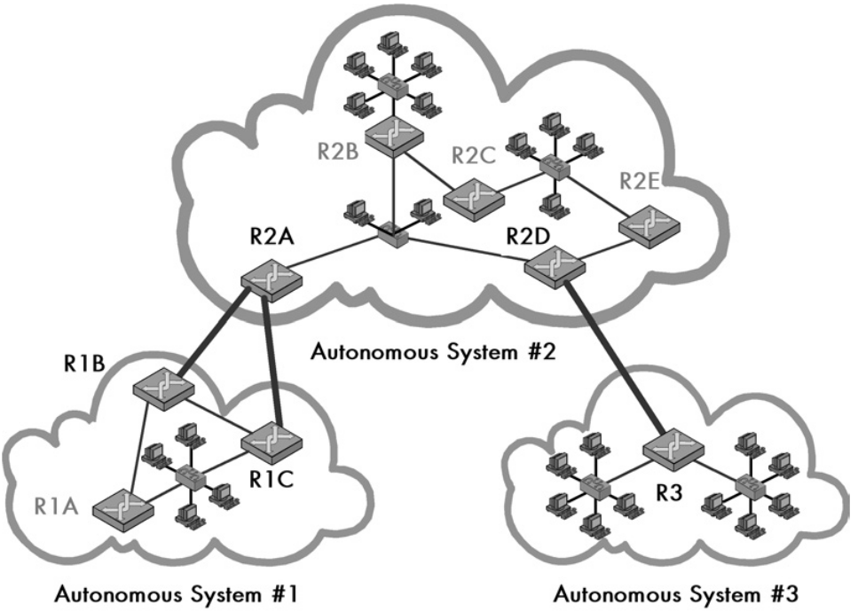

# Concepts of Routing Protocols

*Static Routing*: Routing tables and routing policies in routers are manually
maintained by a network administrator. Not scalable and only ocassionally used
in LAN's.

*Dynamic Routing*: Routing tables and routing policies are maintained
automatically by a routing protocol (the router implements a specific protocol).
Scalable and used throughout the Internet.

Routing protocols are the key to making the Internet work, they allow the
forwarding of packets between different networks at a scalable and efficient
way. They are probably the most important and complex part of the Internet, they
really define the layer 3 of the OSI model.

## Routing Protocol Architectures

The architectures used by routing protocols are really the architecture of the
different networks that compose the Internet, i.e, the way the routers are
organized and the inforation maintained by them.

| Architecture Name                   | Description                                                                                                                                                                                                                                                                                                                                                                                                                                                                                                                                                                                                                                                                                         |
| ----------------------------------- | --------------------------------------------------------------------------------------------------------------------------------------------------------------------------------------------------------------------------------------------------------------------------------------------------------------------------------------------------------------------------------------------------------------------------------------------------------------------------------------------------------------------------------------------------------------------------------------------------------------------------------------------------------------------------------------------------- |
| Core Architecture                   | Used in the early days of the Internet, composed by few *core* routers that contain compreheensive information about the different networks. As the Internet grew, the routing tables in the routers became very large and complex, this type of architecture didn't scale.                                                                                                                                                                                                                                                                                                                                                                                                                         |
| Autonomous System (AS) Architecture | The architecture used today in the Internet, composed by different *autonomous systems (AS)* that are responsible for routing inside them. Autonomous systems are basically large networks that are owned by organizations, ISP's, etc. They are responsible for routing inside them and maintaining their own routers. The Internet today is basically composed of several different autonomous systems and important routers at IXP's that route traffic between them. This architecture is more scalable since it delegates much of the routing responsibility to different ASes. Again AS's are just very large networks maintained by one organization, and Internet is a network of networks. |

Each AS is given an *autonomous system number (ASN)* by their regional internet
registry (RIR). They also get (buy) public IP address blocks from their RIR.
Since the Internet uses the CIDR addressing scheme each AS can distribute or
subnet each block as they see fit, again this is a core principle of the
autonomous system architecture: the ideia that each organization is autonomous
and responsible for itself.

## Routing Protocol Types

The routing protocols can be divided in two types, and are a direct
representation of today's Internet architecture:

*Interior Routing Protocols*: Used to route information inside a particular AS.
The most notable protocols used in the Internet are the Routing Information Protocol (RIP), and the
Open Shortest Path First (OSPF) Protocol.

*Exterior Routing Protocols*: Used to route information between different ASes.
The most notable protocol used in the Internet is the Border Gateway Protocol
(BGP).

From this we can also derive two types of routers present in the Internet:

*Internal Routers*: Routers inside an AS and which mantains information only about
that particular AS. They use only interior routing protocols, and are
responsible for routing inside that AS.

*Border Routers*: Routers present at the "border" of an AS meaning they maintain
information about that particular AS but also other ASes so that routing is
possible between them. They run both interior and exterior routing protocols,
and are responsible for routing traffic between a particular AS and different
outside ASes.

The AS architecture and the division between interior and exterior routing
protocols has become the standard for the Internet.

## Routing Protocol Algorithms and Metrics

The different types of routing protocols mentioned above also used different
algorithms and metrics to classify and forward traffic in the best possible
manner. There are two main types of routing algorithms:

*Distance-Vector (Bellman-Ford) Algorithm*: Forwards traffic based on the
distance between two networks: the number of hops (routers) between them.
Protocols that use this algorithm are very simple but limited in choosing the
best route. Routers using this type of protocol maintain distance information
about each known network (not necessarily directly connected ones only) in their
routing tables.

*Link-State (Shortest-Path First) Algorithm*: Forwards traffic based on network
metrics that are calculated dynamically, these often include throughput, number
of hops, delays, etc. Are much better at determining best routes (the shortest
path between two networks), but also much more complex than distance-vector
algorithms. Like in distance-vector routers mantain information about known
networks metrics.

