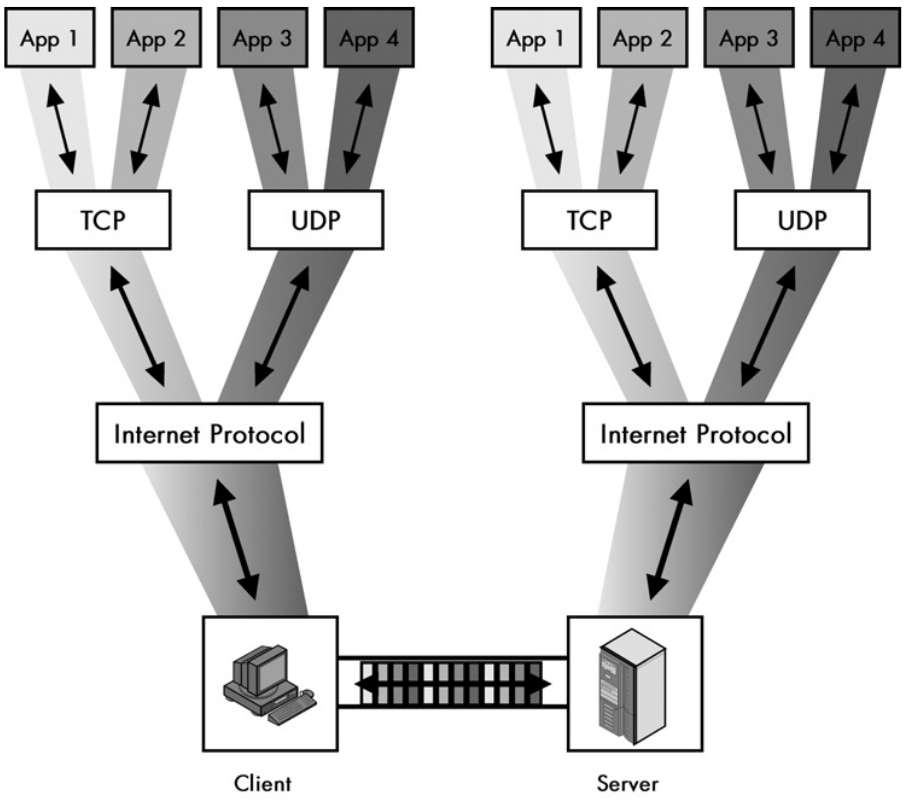

# Transport Protocols

First some important concepts that are needed to understand the transport
protocols used in the Internet: TCP and UDP.

*Multiplexing (sender side)*: Means combining all the proccesses (network
applications) data running on a host so they can be sent over the single network
connection, that is, they are sent over the same NIC (network interface card).

*Demultiplexing (receiving side)*: Means the oposite of multiplexing. When a
host receives the data over the single network connection, that is, it's NIC, it
"seperates" and sends each piece of data to the correct process (network
application). Remember, each network application is identified by the port
number.

NOTE: If a host has more than one IP, and thus more than one NIC, and thus more
than one MAC address, the multiplexing and demultiplexing occurs not over a
single network connection but the number of NIC's that the host has.

